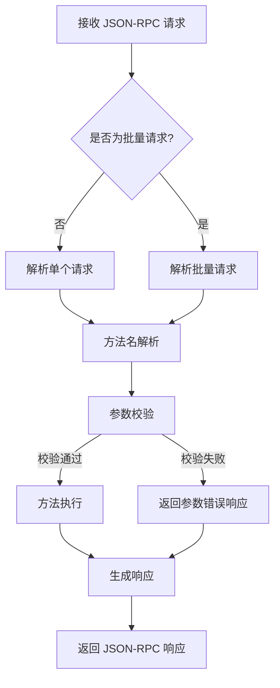

# JSON-RPC Core 主要流程图

```mermaid
graph TD
    A[接收 JSON-RPC 请求] --> B{是否为批量请求?}
    B -- 否 --> C[解析单个请求]
    B -- 是 --> D[解析批量请求]
    C --> E[方法名解析]
    D --> E
    E --> F[参数校验]
    F -- 校验通过 --> G[方法执行]
    F -- 校验失败 --> H[返回参数错误响应]
    G --> I[生成响应]
    H --> I
    I --> J[返回 JSON-RPC 响应]
```

> 此流程图描述了 json-rpc-core 的核心请求处理流程，包括批量与单个请求的分支、方法分发、参数校验、异常处理及响应生成等环节。
